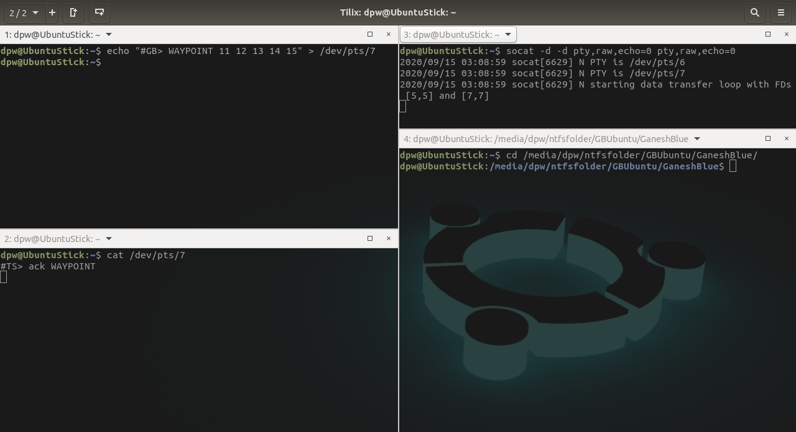

To avoid clock skew on TS : `ssh root@192.168.1.123 "date -s '$(date)'"`

## Notes about Serial I/O

[what is tcdrain](https://pubs.opengroup.org/onlinepubs/009695399/functions/tcdrain.html)
 
 [when to use tcdrain](http://embeddedguruji.blogspot.com/2019/02/serial-port-programming-part-4-tcdrain.html)

 > add tcdrain to serial write, so that write process will be blocked until completion

[what is tcflush](https://pubs.opengroup.org/onlinepubs/007908799/xsh/tcflush.html)

[when to use](http://support.sas.com/documentation/onlinedoc/sasc/doc/lr2/tcflush.htm)

## Write to serial simulation (on terminal) with `socat`
create pair of virtual serial port (a,b) : `socat -d -d pty,raw,echo=0 pty,raw,echo=0`

things written on `/dev/pts/a` can be read on `/dev/pts/b`

### example :

to write on a

`echo "#GB> WAYPOINT 1 2 3 4 5`
        
on other terminal, can be read with

`cat /dev/pts/b`

        
        opened port : `dev/pts/6` and `/dev/pts/7`
        program write on port 6 --> output on port 7
        terminal write on port 7 --> program read on port 6
### template : 
single waypoint : `echo "#GB> WAYPOINT 11 12 13 14 15" > /dev/pts/7`

double waypoint : `echo "#GB> WAYPOINT 11 12 13 14 15 21 22 23 24 25" > /dev/pts/7`

parameter : `echo "#GB> PARAM 2 3 4 5 6 7 8 9 10 11 12 13 14 15 16 17 18 19 20  " > /dev/pts/7`
                   
ping : `echo "#GB> PING 123" > /dev/pts/7`

# On progress
    BB <--> TS
    #TS> OPERATE 0
    #TS> OPERATE 1 03102020181622
    #TS> OPERATE 2
    #TS> OPERATE 3
    #TS> PARAM 15

    reply
    #BB> ack OPERATION
    #BB> ack PARAM
    #BB> ack PING %s%s%s%s%s%s

                - 0 not running = hanya tunggu data dari GCS
                - 1 PINGed = baca semua sensor, kirim ackPING
                - 2 priority = baca priority sensor, kirim data
                - 3 readSensor = baca semua sensor, kirim data
            
                //TS OPERATE 0 ==>> state = 0
                //TS OPERATE 1 ==>> state = 1 PING
                //TS OPERATE 2 ==>> state = 2
                //TS OPERATE 3 ==>> state = 3

    #BB> DATA size .. .. .. .. ..
    ending "/r/n"

    (Volt - Current - Leak)
    #BB> DATA 3 3883.012300 3355.000456 3898.123456\r\n

    (Volt - Current - Leak - OmegaPitch - OmegaHeading - OmegaRoll - accelX - accelY - accelZ - Lat - Lon - VeloX - VeloY - VeloZ)
    #BB> DATA 14 3889.000000 3358.000000 3856.000000 0.000000 0.000000 0.000000 0.000000 0.000000 0.000000 -6.888402 107.610458 0.000000 0.000000 0.000000\r\n
    #BB> DATA 17 1 2 3 4 5 6 7 8 9 10 11 12 13 14 15 16 17\r\n

# Cheatsheet Override Mode
Case and spacing sensitive. 

- Complete navigation and guidance algorithm. 
  - `guidanceisfinished bool`

- Bypass ACK requirement
  - `bbalwaysack bool`
  - `aralwaysack bool`

- Allow forced datalog transmission
  - `datalogalwaysready bool`

- Set to specific datalog
  - `setdatalog name`

- Override BB interval
  - `bbinterval integer`

- Set/reset datalog count
  - `datalogcount integer`

- Activate/Deactivate thread (fatal)
  - `bbthread bool`
  - `arthread bool`
  
# todo

1. locking di BB (yang soal PARAM / OPERATION) awal
2. data sensor random dibikin ada bilangan belakang koma
3. cobain port USB TS untuk komunikasi data (untuk port override)
4. pengiriman data TS ke GCS (gw)